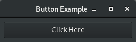

Programming with asyncframes
============================

Frame Hierarchy Model vs. Object Oriented Programming
-----------------------------------------------------

The most common form of Object Oriented Programming (OOP) is class-oriented programming. In this form programs are designed using **classes** and **objects**. A **class** defines the structure of a conceptual entity. After a class is defined, the programmer can create one or more **objects** of that entity. These objects are also known as instances of the class.

The **state** and **behavior** of objects are defined within the class by creating variables and methods respectively. Different objects of the same class can contain different data (i.e. values), but their state (i.e. variables) and behavior (i.e. methods) are the same. Dynamic languages, like Python, allow manipulation of state and behavior at runtime.

In the Frame Hierarchy Model (FHM) programs are designed using **frame classes**, **frame instances** and **frames**. The **frame class** defines static state and behavior, similar to the class in OOP. The **frame** defines dynamic state and behavior, that is specific to a single instance of a frame class. After a frame is defined, the programmer can create one or more **frame instances** of it, similar to objects in OOP.

Any class deriving from one of the fundamental frame classes *Frame*, *PFrame* or *DFrame* is by definition a frame class. Frame instances are created by instantiating frames and frames are created by instantiating frames classes. Frames can be created without any general state or behavior by directly instantiating one of the fundamental frame classes. ::

    class ButtonFrame(asyncframes.Frame):
        """An example frame class."""

    @ButtonFrame
    async def button_frame():
        """An example frame."""

    @Frame
    async def helper_frame():
        """An example frame without a frame class."""

    button = button_frame(): # An example frame instance.

.. note:: The differences between *Frame*, *PFrame* and *DFrame* are explained in chapter :doc:`parallel_programming_model`.

In a way, FHM adds another layer between classes and objects. The additional third layer may seem to add complexity to the programming model, but it can be strictly separated by the following principle:

.. tip:: State and behavior that is general enough to be applicable to different programs should be defined via **frame classes**. State and behavior that is specific to a single program should be defined via **frames**.

Ideally most frame classes should be defined in separate Python packages, so they can be reused across projects (see ``examples/frame_libraries`` in the git repository).

Example
-------

To illustrate the differences between frame classes, frame instances and frames, let's consider a simple use case:

We would like to create a button in a user interface that prints the line "Hello World!" when clicked.

Creating frame classes for Gtk.Window and Gtk.Button
^^^^^^^^^^^^^^^^^^^^^^^^^^^^^^^^^^^^^^^^^^^^^^^^^^^^

First we create a frame class that represents a GTK window:

.. literalinclude:: ../../examples/gtk_button.py
    :lines: 9-16
    :linenos:

The class ``Window`` is a frame class because it derives from :py:class:`asyncframes.Frame`. In line 8, we connect the window's destroy event to the :py:meth:`asyncframes.Awaitable.remove()` method. This will remove the frame when the user closes the window. The rest of this code snippet is required to enable multiple inheritance in Python:

Lines 1 and 2 declare a metaclass that derives from both the metaclass of ``Frame`` (i.e. ``FrameMeta``) and ``Gtk.Window`` (i.e. ``type(GObject)``).
Lines 6 and 7 call the constructors of both base classes. Note that we are pass through any arguments of the window frame class to the GTK window. We will use this later to pass a title string to the window.

Now let's create another frame class for buttons:

.. literalinclude:: ../../examples/gtk_button.py
    :lines: 18-27
    :linenos:

The ``Button`` frame class derives from both ``Frame`` and ``Gtk.Button``. After calling the constructors of both base classes, we add the button to its window. Remember that any FHM program consists of a hierarchy of frames. To find the window this button belongs to, we use the function ``asyncframes.find_parent(parenttype)`` to search the hierarchy for the closest ancestor of type ``Window``. Finally, in lines 7 through 10, we create an ``asyncframes.Event`` and connect it to the *clicked* event of the GTK button.

Creating a FHM program using Window and Button
^^^^^^^^^^^^^^^^^^^^^^^^^^^^^^^^^^^^^^^^^^^^^^

Let's use ``Window`` and ``Button`` frame classes to create a simple GUI application:

.. literalinclude:: ../../examples/gtk_button.py
    :lines: 29-45
    :linenos:

We start by creating a main frame of type ``Window`` in lines 1 and 2. Since our ``Window`` frame class is forwarding all arguments to the underlying ``Gtk.Window``, we can pass the window title when creating the frame. The ``self`` argument is optional in asyncframes. It refers to the frame just like the ``self`` argument on a Python method.

In lines 11 to 13 we use ``self`` to call methods of the ``Gtk.Window``. Line 11 resizes the window, line 12 adds padding around our button and line 13 displays the window.

Line 14 is important to keep the ``main_frame`` from going out of scope. Frame classes are removed when they go out of scope and the window is part of our ``main_frame``. Accordingly, without ``await hold()`` our application would close the window and exit immediately.

.. note:: ``await hold()`` is semantically equivalent to ``await sleep(sys.float_info.max)``

The last thing to define is our button. FHM allows us to create the button and define its entire life cycle in a single block of code (lines 3 to 9). If we were to completely remove all code related this button in the future, we would only need to remove or comment-out these lines. Lines 3 to 8 define the button frame and line 9 creates a frame instance.

.. note:: We define ``button_frame`` inside ``main_frame`` to emphasize that this button is a child of the window in the frame hierarchy. This is not a requirement. The button's position in the hierarchy only depends on where the frame instance is created (line 9). Accordingly, it wouldn't affect the application if we defined ``button_frame`` outside ``main_frame``.

Similar to the window title, we pass the button text as an argument when creating the button frame (line 3).

Lines 5 to 8 define the behavior of the button. In our case we start by making the button visible (line 5) and then we print "Hello World!" (line 8) every time (line 6) the button is clicked (line 7).

Running the example
^^^^^^^^^^^^^^^^^^^

To run an FHM application that uses GTK, we need to invoke the main frame from an eventloop that is implemented on top of the GLib event system:

.. literalinclude:: ../../examples/gtk_button.py
    :lines: 44-45
    :linenos:

This example requires asyncframes and GTK for Python: ::

    pip install asyncframes pygobject

The created window will look like this:

Whenever the button is pressed, "Hello World!" will be displayed in the output terminal or console.
